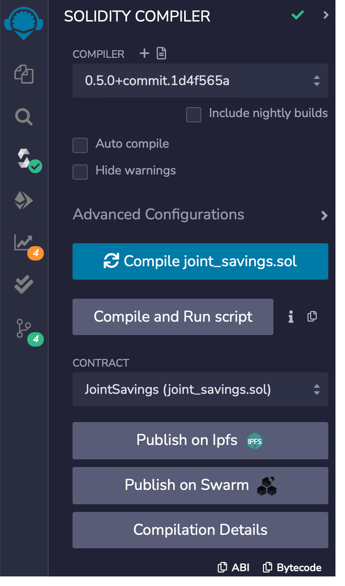
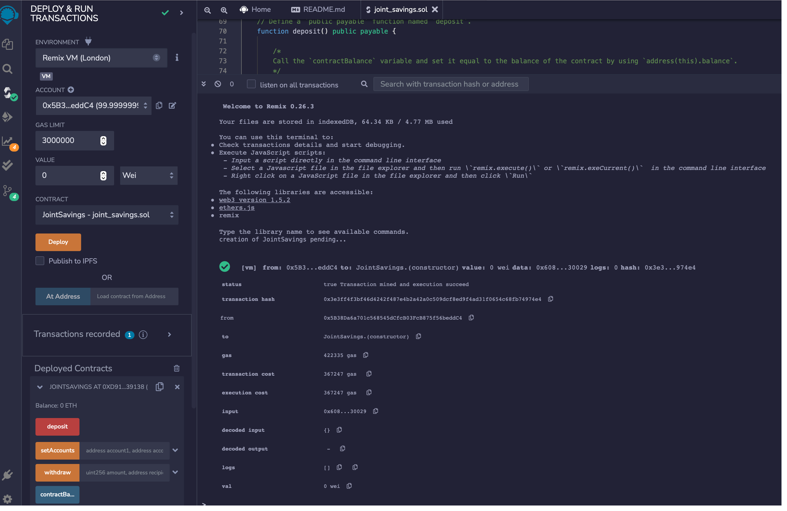
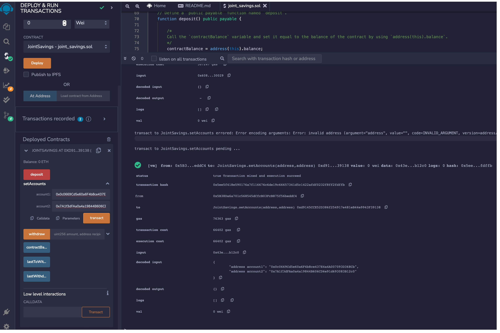
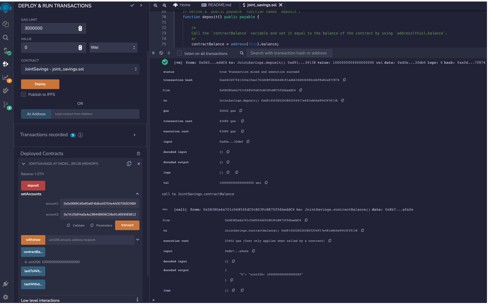
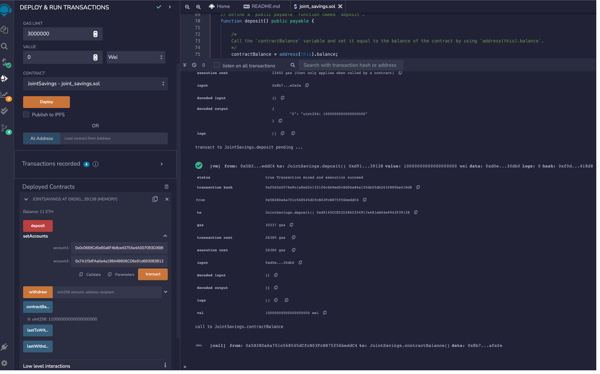
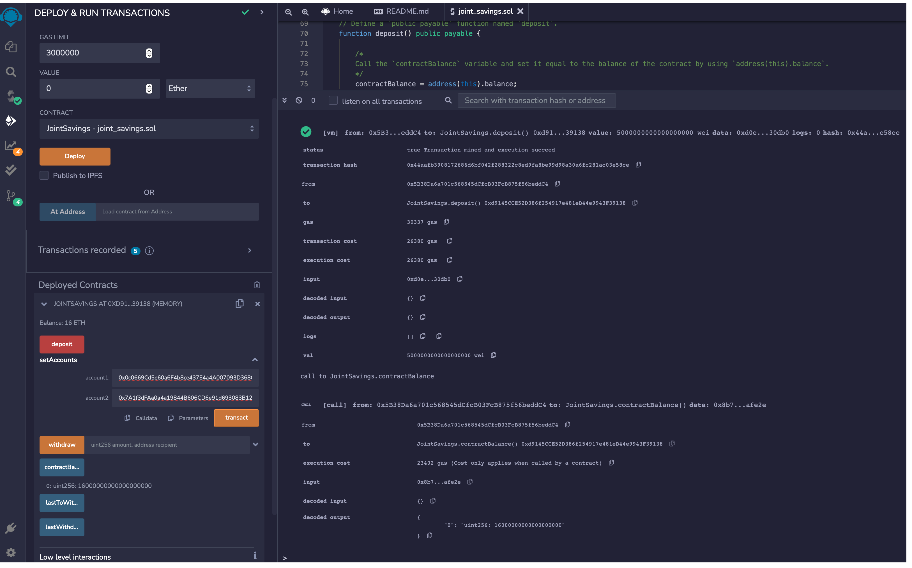
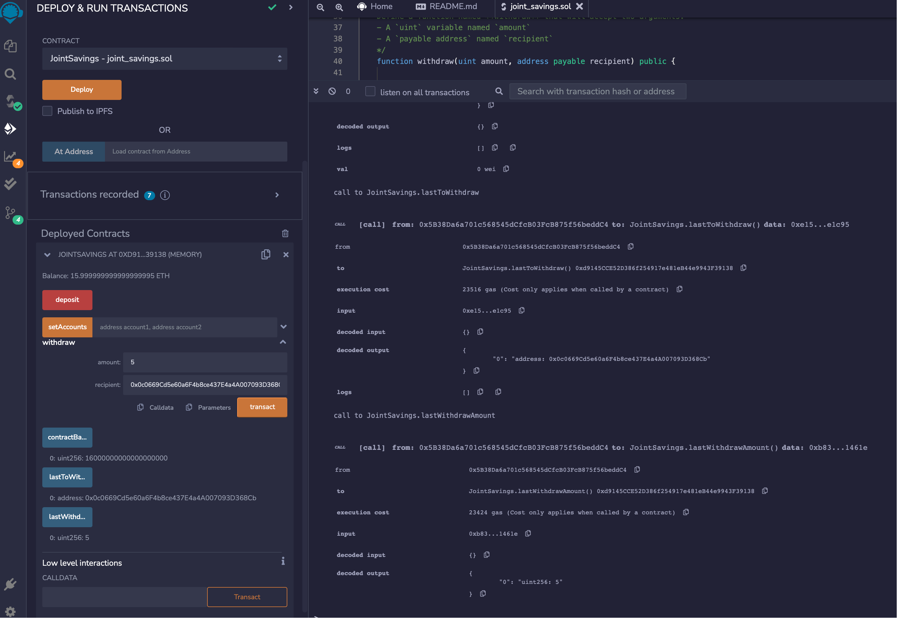
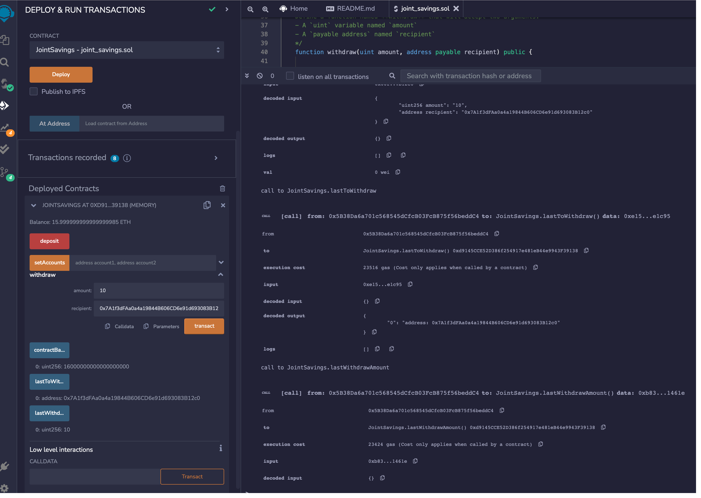

# Module_20 - Smart Contracts with Solidity

A fintech startup company has recently hired me. This company is disrupting the finance industry with its own cross-border, Ethereum-compatible blockchain that connects financial institutions. Currently, the team is building smart contracts to automate many of the institutions’ financial processes and features, such as hosting joint savings accounts.

To automate the creation of joint savings accounts, I’ll create a Solidity smart contract that accepts two user addresses. These addresses will be able to control a joint savings account. My smart contract will use ether management functions to implement a financial institution’s requirements for providing the features of the joint savings account. These features will consist of the ability to deposit and withdraw funds from the account.

---

## Technologies

This project leverages Solidity Version 0.5.0 using the following IDE:

* [Remix IDE](https://remix.ethereum.org/) - Remix IDE is used for the entire journey of smart contract development by users at every knowledge level. It requires no setup, fosters a fast development cycle and has a rich set of plugins with intuitive GUIs.

---

## Installation Guide

No new installations are required.  

---

## Usage

Just upload the Solidity file contained in this repository to your Remix IDE workspace.

### Successful Compilation

### Successful Deployment

### Authorizing Ethereum Addresses Using setAccounts Function

### Deposit 1 ether as wei

### Deposit 10 ether as wei

### Deposit 5 ether

### Withdraw 5 ether into accountOne

### Withdraw 10 ether into accountTwo

---

## Contributors

Starter code was provided by UW Fintech Bootcamp.  Updates and analysis by Jason Buckholt.  

---

## License

MIT License

Copyright (c) 2022 Jason Buckholt

Permission is hereby granted, free of charge, to any person obtaining a copy of this software and associated documentation files (the "Software"), to deal in the Software without restriction, including without limitation the rights to use, copy, modify, merge, publish, distribute, sublicense, and/or sell copies of the Software, and to permit persons to whom the Software is furnished to do so, subject to the following conditions:

The above copyright notice and this permission notice shall be included in all copies or substantial portions of the Software.

THE SOFTWARE IS PROVIDED "AS IS", WITHOUT WARRANTY OF ANY KIND, EXPRESS OR IMPLIED, INCLUDING BUT NOT LIMITED TO THE WARRANTIES OF MERCHANTABILITY, FITNESS FOR A PARTICULAR PURPOSE AND NONINFRINGEMENT. IN NO EVENT SHALL THE AUTHORS OR COPYRIGHT HOLDERS BE LIABLE FOR ANY CLAIM, DAMAGES OR OTHER LIABILITY, WHETHER IN AN ACTION OF CONTRACT, TORT OR OTHERWISE, ARISING FROM, OUT OF OR IN CONNECTION WITH THE SOFTWARE OR THE USE OR OTHER DEALINGS IN THE SOFTWARE.